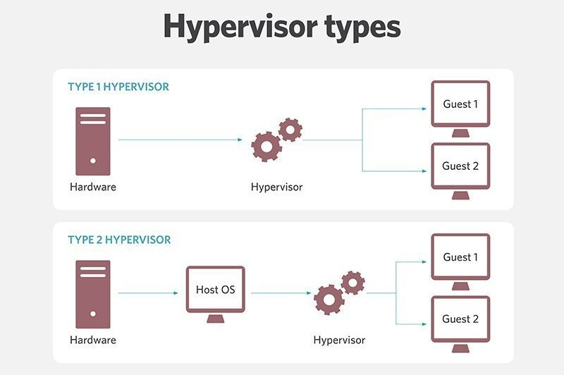

# Virtualization 🚀

Virtualization is the process of creating a software-based (virtual) version of something using hypervisor software. This can include virtualizing compute, storage, networking, servers, or applications.

## Host and Hypervisor 💻

### Hypervisor Definition:
A hypervisor is a software, firmware, or hardware component that creates and manages virtual machines (VMs) on a physical computer. It allows multiple operating systems to run concurrently on a single host

### Types of Hypervisors:

#### Type 1 Hypervisor (Bare Metal Hypervisor)
A Type 1 hypervisor is a virtualization technology that runs directly on the hardware of a host system without the need for an underlying operating system. It provides high performance and is typically used in enterprise environments for server virtualization
Examples of Type 1 hypervisors include:
- **XenServer** by Citrix
- **ESXi** by VMware
- **Hyper-V** from Microsoft
- **VM** from Oracle
- **Open source KVM**

#### Type 2 Hypervisor (Hosted Hypervisor)
A Type 2 hypervisor is a virtualization technology that runs on a conventional operating system just like any other software application. It is often used for desktop virtualization and testing purposes, allowing users to run multiple virtual machines on their personal computers without dedicated hardware support
Examples of Type 2 hypervisors include:
- **VMware**
- **Oracle VirtualBox**
- **Client Hyper-V**

## Hardware Requirements 💾

To enable virtualization, your hardware should meet the following requirements:
- CPU must support hardware-assisted virtualization (HAV)
- Enable virtualization technology in EFI BIOS
- Strong processor and memory
- Adequate hard drive space

---

# VirtualBox 🚀

## What is a VirtualBox

VirtualBox is open-source software for virtualizing the x86 computing architecture. It acts as a hypervisor type 2, creating a VM  where the user can run another OS .

The operating system where VirtualBox runs is called the "host" OS. The operating system running in the VM is called the "guest" OS. VirtualBox supports Windows, Linux, or macOS as its host OS.

## UTM vs VirtualBox: Which is Better for Virtual Machines?

As a Mac user you have two superb choices available for running virtual machines, both are open source and both are entirely free.

- **VirtualBox** is a well known solution for creating virtual machines offered by heavyweight computer technology company Oracle. It was originally released in 2007 and is available for macOS, Windows and Linux hosts.

- **UTM** (Universal Turing Machine) is actually a frontend GUI for the all-powerful open source emulation platform QEMU, offering a beautiful interface native to Apple products. It is available for both macOS and iOS devices.

# Operating System 🚀

Operating System basically its manages all the resources of the computer we can say acts as an interface between the software and different parts of the computer or the computer hardware.

